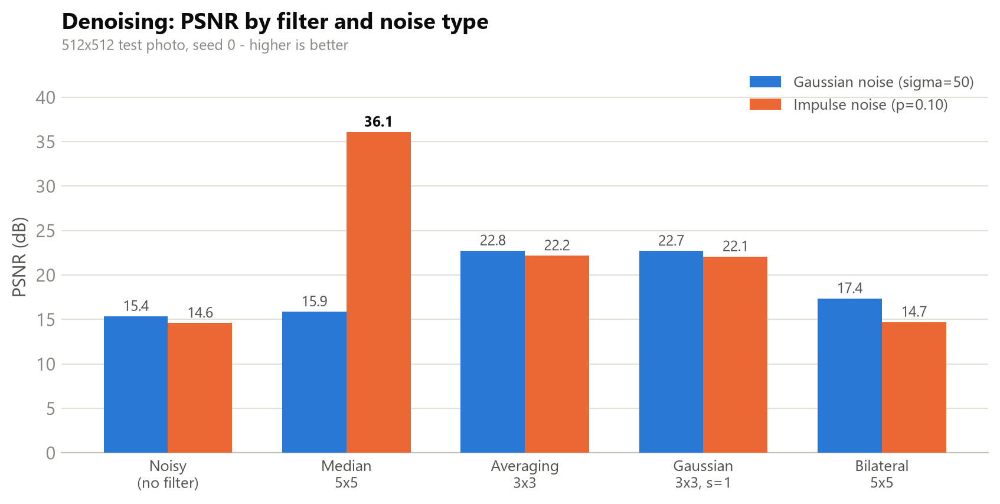
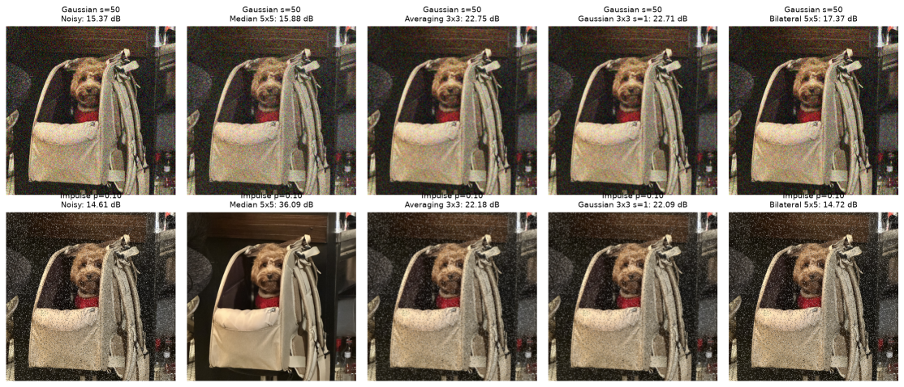
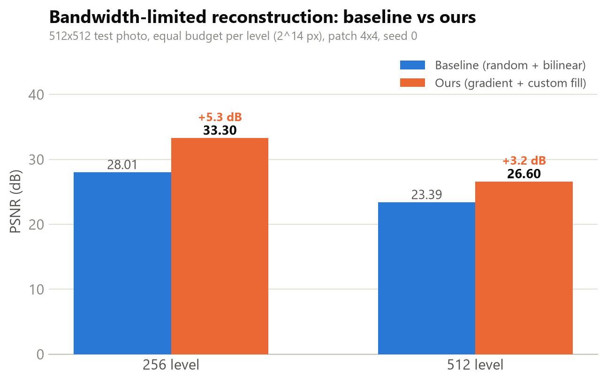

# GAPS

 

**GAPS (Gradient-Aware Patch Selection)** — classical (non-deep-learning) image
restoration for UAV imaging, implemented from scratch with NumPy. The name is
the proposed method: under a limited transmission budget, patches are selected
by gradient energy and the untransmitted *gaps* are filled by a custom forward
interpolation. This project accompanies the report
*Classical Image Restoration for UAV Imaging* (see `docs/`) and has two parts:

1. **Denoising** — synthesize Gaussian and salt-and-pepper (impulse) noise,
   then apply every hand-coded filter (**median**, **averaging**, **Gaussian**,
   **bilateral**) to every noise type and report the full PSNR matrix.

2. **Bandwidth-limited reconstruction** — build an image pyramid
   (512 → 256 → 128), transmit only a budgeted subset of patches per level,
   and reconstruct the full-resolution image. A **baseline**
   (random patch selection + bilinear interpolation) is compared against
   **ours / GAPS** (gradient-based patch selection + sparse expand and
   neighborhood-weighted fill), scored by PSNR at both pyramid levels.

All numerical work is hand-written in NumPy. OpenCV is used only for image I/O
and color conversion, and Matplotlib only for visualization.

## Results

Both scripts run on the committed 512×512 test photo
([`results/input_dog.png`](results/input_dog.png)) with `--seed 0`,
so every number below is reproducible with the commands in **Usage**.

### 1. Denoising (PSNR, dB — higher is better)

Every filter applied to every noise type. The matrix shows each filter's
specialty rather than a single cherry-picked pairing:

| Noise | Noisy (no filter) | Median 5×5 | Averaging 3×3 | Gaussian 3×3 σ=1 | Bilateral 5×5 |
| --- | ---: | ---: | ---: | ---: | ---: |
| Gaussian σ=50 | 15.37 | 15.88 | **22.75** | 22.71 | 17.37 |
| Impulse p=0.10 | 14.61 | **36.09** | 22.18 | 22.09 | 14.72 |



- The **median** filter (implemented with 0/255 impulse detection) is the clear
  impulse-noise specialist: **+21.5 dB** over the noisy input, while leaving
  Gaussian noise almost untouched.
- **Linear smoothing** (averaging / Gaussian kernel) is the better choice for
  Gaussian noise (~+7.4 dB) but cannot remove impulse outliers.
- The **bilateral** filter preserves edges by design; with a conservative range
  sigma it trades PSNR for edge sharpness on this heavy (σ=50) noise.

Visual comparison (top row: Gaussian noise, bottom row: impulse noise):



### 2. Bandwidth-limited reconstruction (PSNR, dB)

Image pyramid 512 → 256 → 128 with an equal transmission budget per level
(2¹⁴ pixels, 4×4 patches). GAPS selects patches by gradient energy — scored on
the receiver-side upsample, so the selection needs no extra side channel — and
fills the gaps with sparse expand + neighborhood-weighted interpolation:

| Pipeline | 256 level | 512 level |
| --- | ---: | ---: |
| Baseline (random patches + bilinear) | 28.01 | 23.39 |
| **Ours / GAPS** (gradient patches + custom fill) | **33.30** | **26.60** |



GAPS beats the equal-budget baseline at both pyramid levels: **+5.3 dB** at
256 and **+3.2 dB** at 512.

## Test image

The original report used two local test images (`lena.bmp` for denoising and a
UAV frame `4611.png` for reconstruction); neither is redistributed here. To
keep the pipeline reproducible with no external data, a 512×512 test photo
(center-cropped and resized) is committed at `results/input_dog.png` and used
as the default input.

> `results/input_dog.png` is the author's own photograph — © 2026 donghyeoni,
> all rights reserved. It is included in this repository only as a benchmark
> test input and is **not** covered by the MIT license, which applies to the
> code.

You can still pass your own image:

```bash
python scripts/01_denoising.py --image data/your_image.png
python scripts/02_reconstruction.py --image data/your_uav_frame.png
```

Any RGB image works. For the reconstruction demo a roughly square image
(e.g. 512×512) matches the 512 → 256 → 128 pyramid most cleanly.

## Structure

```
GAPS/
├── restoration/               # reusable library (NumPy implementations)
│   ├── __init__.py
│   ├── metrics.py             # psnr()
│   ├── noise.py               # g_noise() Gaussian, i_noise() impulse
│   ├── denoise.py             # median / averaging / gaussian / bilateral filters
│   ├── pyramid.py             # downsampling(), expand(), assemble()
│   ├── interpolate.py         # bilinear(), bicubic_upsampling(), cubic_weight(),
│   │                          #   restoration1/2/3()
│   └── patch_select.py        # random / gradient / frequency (FFT) / laplacian choose
├── scripts/
│   ├── 01_denoising.py        # denoising benchmark: 4 filters x 2 noise types + PSNR
│   └── 02_reconstruction.py   # bandwidth-limited reconstruction (baseline vs ours + PSNR)
├── results/                   # committed artifacts: input image, figures, PSNR charts
├── docs/
│   └── Classical Image Restoration for UAV Imaging.pdf
├── data/                      # optional: your own test image(s) here (git-ignored)
├── requirements.txt
├── .gitignore
└── README.md
```

## Setup

```bash
python -m venv .venv
# Windows:  .venv\Scripts\activate
# macOS/Linux:  source .venv/bin/activate

pip install -r requirements.txt
```

Requires Python 3.8+ and the packages in `requirements.txt`
(`numpy`, `opencv-python`, `matplotlib`).

## Usage

Reproduce the committed results (defaults to the committed test photo):

```bash
python scripts/01_denoising.py --seed 0 --save results/denoising_comparison.png --no-show
python scripts/02_reconstruction.py --seed 0
```

Using the library directly:

```python
import cv2
from restoration import g_noise, median_filter, psnr

img = cv2.cvtColor(cv2.imread("data/your_image.png"), cv2.COLOR_BGR2RGB)
noisy = g_noise(img, 50)
clean = median_filter(noisy, 5)
print(psnr(img, clean))
```

## Notes

- The filters and interpolators are written for clarity, not speed: they use
  explicit Python loops over pixels, so they can be slow on large images.
- The `psnr` function assumes a max value of 1.0 for floating-point images and
  255.0 for integer images.
- The median filter is an impulse-detection variant: it replaces only pixels
  whose value is exactly 0 or 255, which is why it barely changes
  Gaussian-noisy images.
- Noise synthesis and random patch selection are stochastic; both scripts
  accept `--seed`, and the committed results use `--seed 0`.
- Other patch selectors (frequency / Laplacian) are available in
  `restoration.patch_select` for experimentation.
