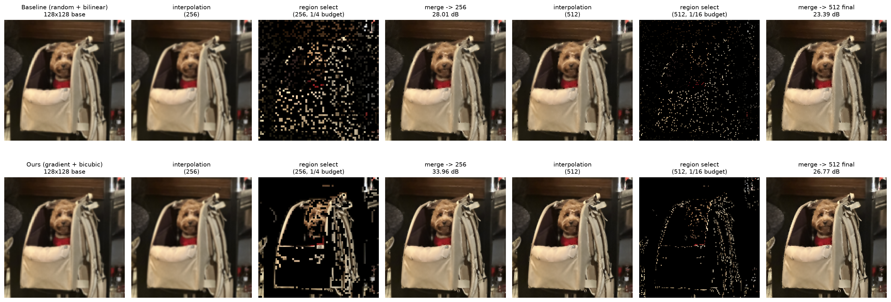

# GAPS

 

**GAPS (Gradient-Aware Patch Selection)** — classical (non-deep-learning) image
restoration for UAV imaging, implemented from scratch with NumPy. The name is
the proposed method: under a limited transmission budget, patches are selected
by gradient energy and the untransmitted *gaps* are filled by a custom forward
interpolation. This project accompanies the report
*Classical Image Restoration for UAV Imaging* (see `docs/`) and has two parts:

1. **Denoising** — synthesize Gaussian and salt-and-pepper (impulse) noise,
   then apply every hand-coded filter (**median**, **averaging**, **Gaussian**,
   **bilateral**) to every noise type and report the full PSNR matrix.

2. **Bandwidth-limited reconstruction** — build an image pyramid
   (512 → 256 → 128), transmit only a budgeted subset of patches per level,
   and reconstruct the full-resolution image. A **baseline**
   (random patch selection + bilinear interpolation) is compared against
   **ours / GAPS** (gradient-based patch selection + sparse expand and
   neighborhood-weighted fill), scored by PSNR at both pyramid levels.

All numerical work is hand-written in NumPy. OpenCV is used only for image I/O
and color conversion, and Matplotlib only for visualization.

## Results

### 1. Denoising (PSNR, dB — higher is better)

**Kernel 3×3** (Gaussian/Bilateral spatial std = 15)

| Noised image | Initial PSNR | Median | Averaging | Gaussian | Bilateral C=30 | Bilateral C=45 | Bilateral C=75 |
| --- | ---: | ---: | ---: | ---: | ---: | ---: | ---: |
| Impulse p=0.05 | 18.20 | **43.92** | 26.19 | 26.19 | 19.24 | 20.64 | 22.33 |
| Impulse p=0.1 | 15.17 | **39.19** | 23.44 | 23.44 | 15.26 | 16.64 | 18.93 |
| Gaussian std=10 | 28.13 | 28.18 | 31.37 | 31.39 | **33.03** | 31.81 | 31.07 |
| Gaussian std=30 | 18.86 | 19.08 | 26.86 | 26.86 | 22.25 | 25.90 | **27.97** |
| Gaussian std=50 | 14.82 | 15.37 | **23.39** | **23.39** | 16.27 | 18.92 | 22.60 |

**Kernel 5×5** (Gaussian/Bilateral spatial std = 15)

| Noised image | Initial PSNR | Median | Averaging | Gaussian | Bilateral C=30 | Bilateral C=45 | Bilateral C=75 |
| --- | ---: | ---: | ---: | ---: | ---: | ---: | ---: |
| Impulse p=0.05 | 18.20 | **42.61** | 26.98 | 26.98 | 18.29 | 19.52 | 22.34 |
| Impulse p=0.1 | 15.17 | **39.28** | 25.13 | 25.13 | 15.31 | 15.85 | 18.90 |
| Gaussian std=10 | 28.13 | 28.17 | 28.99 | 29.00 | **32.75** | 31.81 | 30.55 |
| Gaussian std=30 | 18.86 | 19.09 | 27.47 | 27.48 | 23.20 | 25.88 | **27.95** |
| Gaussian std=50 | 14.82 | 15.42 | **25.38** | **25.38** | 16.83 | 18.93 | 22.63 |

### 2. Bandwidth-limited reconstruction (PSNR, dB)

Image pyramid 512 → 256 → 128 with an equal transmission budget per level
(2¹⁴ pixels, 4×4 patches), run on the committed 512×512 test photo
([`results/input_dog.png`](results/input_dog.png)) with `--seed 0` — every
number here is reproducible with the commands in **Usage**.

**Why this design** — the rationale behind GAPS:

- **Spend the budget where interpolation fails.** Smooth regions are already
  well approximated by upsampling the low-resolution base the receiver has,
  so transmitting them wastes budget. Upsampling error concentrates at edges
  and texture — exactly the regions with high gradient energy — so GAPS ranks
  patches by gradient magnitude and transmits only the top-k, instead of a
  random subset.
- **No side channel needed.** Patch scores are computed on the *receiver-side
  upsample* (the bilinear blow-up of the level below), which both ends can
  reproduce identically. The sender never has to transmit which patches were
  chosen — the selection itself costs zero extra bandwidth.
- **Use every received pixel.** Plain bilinear reconstruction upsamples the
  low-resolution base and ignores the transmitted high-resolution patches
  right next to a gap. The custom forward fill (sparse expand +
  neighborhood-weighted averaging) reconstructs each missing pixel from its
  nearest actual measurements, whether they came from the base or from a
  transmitted patch.

Every selection × fill combination under the same budget — each cell is
`256 / 512` PSNR in dB; **random + bilinear is the baseline**, everything
else is ours:

| Selection \ Fill | Bilinear | Bicubic | Forward |
| --- | ---: | ---: | ---: |
| Random | 28.01 / 23.39 *(baseline)* | 28.52 / 23.63 | 28.12 / 23.55 |
| Frequency | 28.03 / 23.24 | 28.52 / 23.47 | 27.96 / 23.25 |
| Laplacian | 28.38 / 23.67 | 28.91 / 23.90 | 28.51 / 23.79 |
| Gradient | 33.43 / 26.54 | **33.96 / 26.77** | 33.30 / 26.60 |

The best combination, **gradient selection + bicubic fill**, beats the
baseline by **+6.0 dB** at 256 and **+3.4 dB** at 512. Selection matters far
more than the fill: gradient selection lifts every fill by ~5 dB, while
fill choice moves the result by a few tenths.

Pipeline progression — baseline (top row) vs the best ours (bottom row).
Each row reads left to right:
`128 base → interpolation → region select → merge (256) → interpolation →
region select → merge (512, final)`:



## Test image

> `results/input_dog.png` is the author's own photograph — © 2026 donghyeoni,
> all rights reserved. It is included in this repository only as a benchmark
> test input and is **not** covered by the MIT license, which applies to the
> code.

## Structure

```
GAPS/
├── restoration/               # reusable library (NumPy implementations)
│   ├── __init__.py
│   ├── metrics.py             # psnr()
│   ├── noise.py               # g_noise() Gaussian, i_noise() impulse
│   ├── denoise.py             # median / averaging / gaussian / bilateral filters
│   ├── pyramid.py             # downsampling(), expand(), assemble()
│   ├── interpolate.py         # bilinear(), bicubic_upsampling(), cubic_weight(),
│   │                          #   restoration1/2/3()
│   └── patch_select.py        # random / gradient / frequency (FFT) / laplacian choose
├── scripts/
│   ├── denoising/             # one demo per filter (+ _common.py helpers)
│   │   ├── median_filter.py
│   │   ├── averaging_filter.py
│   │   ├── gaussian_filter.py
│   │   └── bilateral_filter.py
│   └── enhancement/           # one demo per method (+ _common.py pipeline)
│       ├── baseline.py                # random selection + bilinear (baseline)
│       ├── bicubic_interpolation.py   # ours: interpolation 1
│       ├── forward_interpolation.py   # ours: interpolation 2
│       ├── frequency_selection.py     # ours: selection 1 (FFT energy)
│       ├── laplacian_selection.py     # ours: selection 2 (Laplacian residual)
│       ├── gradient_selection.py      # ours: selection 3 (gradient magnitude)
│       └── benchmark.py               # every selection x fill -> table + figures
├── results/                   # committed artifacts: input image, figures, PSNR charts
├── docs/
│   └── Classical Image Restoration for UAV Imaging.pdf
├── data/                      # optional: your own test image(s) here (git-ignored)
├── requirements.txt
├── .gitignore
└── README.md
```

## Setup

```bash
python -m venv .venv
# Windows:  .venv\Scripts\activate
# macOS/Linux:  source .venv/bin/activate

pip install -r requirements.txt
```

Requires Python 3.8+ and the packages in `requirements.txt`
(`numpy`, `opencv-python`, `matplotlib`).

## Usage

Denoising demos — one script per filter (defaults to the committed test photo):

```bash
python scripts/denoising/median_filter.py --seed 0
python scripts/denoising/averaging_filter.py --seed 0
python scripts/denoising/gaussian_filter.py --seed 0
python scripts/denoising/bilateral_filter.py --seed 0
```

Enhancement demos — one script per method:

```bash
python scripts/enhancement/baseline.py --seed 0
python scripts/enhancement/bicubic_interpolation.py --seed 0
python scripts/enhancement/forward_interpolation.py --seed 0
python scripts/enhancement/frequency_selection.py --seed 0
python scripts/enhancement/laplacian_selection.py --seed 0
python scripts/enhancement/gradient_selection.py --seed 0
```

Reproduce the full Results table and figures (pure-Python loops — takes tens
of minutes):

```bash
python scripts/enhancement/benchmark.py --seed 0 --save results/reconstruction_progression.png
```

Using the library directly:

```python
import cv2
from restoration import g_noise, median_filter, psnr

img = cv2.cvtColor(cv2.imread("data/your_image.png"), cv2.COLOR_BGR2RGB)
noisy = g_noise(img, 50)
clean = median_filter(noisy, 5)
print(psnr(img, clean))
```

## Notes

- The filters and interpolators are written for clarity, not speed: they use
  explicit Python loops over pixels, so they can be slow on large images.
- The `psnr` function assumes a max value of 1.0 for floating-point images and
  255.0 for integer images.
- The median filter is an impulse-detection variant: it replaces only pixels
  whose value is exactly 0 or 255, which is why it barely changes
  Gaussian-noisy images.
- Noise synthesis and random patch selection are stochastic; both scripts
  accept `--seed`, and the committed results use `--seed 0`.
- Other patch selectors (frequency / Laplacian) are available in
  `restoration.patch_select` for experimentation.
